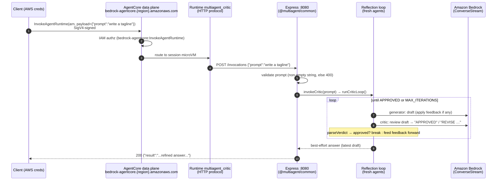
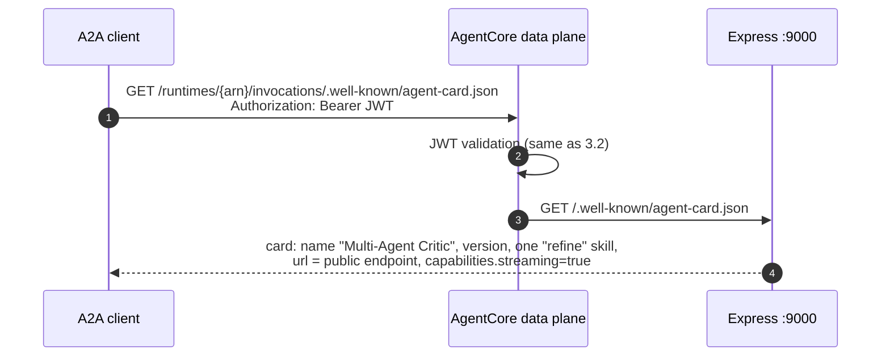
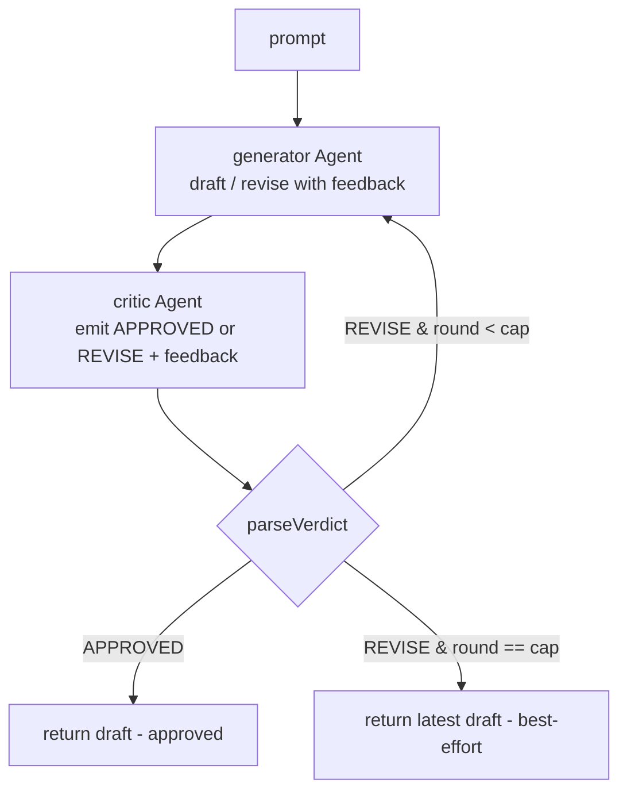
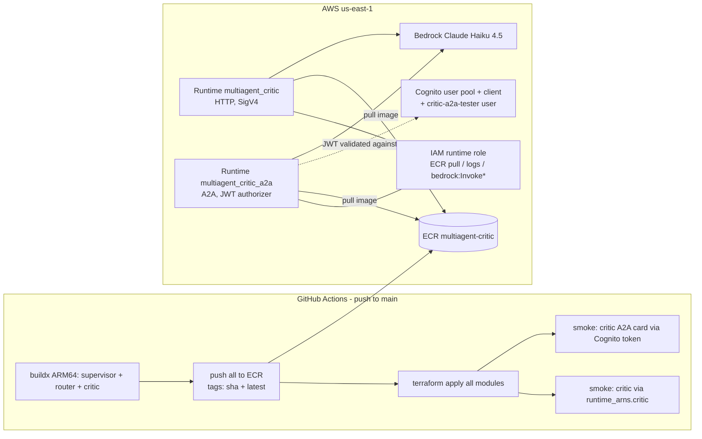

# Critic agent — architecture

Technical reference for the `agents/critic` deployable: components, deployment
topology, and how a client request flows through the **reflection loop** end to end.
Companion to the [router's architecture](../router/ARCHITECTURE.md) and the
[supervisor's](../supervisor/ARCHITECTURE.md) — same deployment plumbing, a third
orchestration primitive.

Code: [agents/critic/src/](../../../agents/critic/src/) ·
Infra: [infra/critic.tf](../../../infra/critic.tf),
[infra/critic-a2a.tf](../../../infra/critic-a2a.tf) ·
History: [CHANGELOG.md](../../../CHANGELOG.md) iter 7.

---

## 1. What it is

The critic is a **generator↔critic reflection loop** built on the Strands Agents SDK
(TypeScript, ESM, Node 20, ARM64). Unlike the supervisor (agent-as-tool, a *model*
picks a tool) and the router (an explicit `Graph` with conditional edges), refinement
here is an **explicit code loop**: a `generator` agent drafts an answer, a `critic`
agent reviews it, and the loop feeds the critique into the next draft until the critic
approves **or** a max-iterations cap is reached.

```
generate ─▶ critique ─(REVISE: feedback)─▶ generate (revise) ─▶ critique ─▶ …
                     └─(APPROVED)───────────────────────────────▶ done
                     └─(cap reached)──────────────────────────────▶ best-effort draft
```

Both roles are focused Strands `Agent`s sharing the critic's Bedrock model (Claude
Haiku 4.5 by default, via `MODEL_ID`); all run **in-process**.

One Docker image. Two AgentCore runtimes run that same image with different
protocols — the image decides what to serve from env vars:

| Runtime | Protocol | Port / path | Auth | Purpose |
|---|---|---|---|---|
| `multiagent_critic` | HTTP | `:8080` `/invocations` + `/ping` | AWS SigV4 | programmatic AWS callers, CI smoke test |
| `multiagent_critic_a2a` | A2A | `:9000` `/` (JSON-RPC) + agent card + `/ping` | OAuth JWT (Cognito) | the **public door** — browser A2A clients (a2d-ai tester) |

---

## 2. Components

### Process layout (inside the container)

```
node agents/critic/dist/app.js
│
├── Express app #1  :8080            ← always on (AgentCore HTTP contract)
│   ├── GET  /ping          → {"status":"ok"}
│   └── POST /invocations   → invokeCritic(prompt) → {"result": "..."}
│       (from @multiagent/common — SDK-agnostic wrapper)
│
└── Express app #2  :9000            ← only when A2A_ENABLED=true
    ├── GET  /ping                          → {"status":"Healthy"}   (A2A contract)
    ├── GET  /.well-known/agent-card.json   → Agent Card
    └── POST /                              → A2A JSON-RPC (message/send, message/stream)
        (SDK middleware: A2AExpressServer → DefaultRequestHandler → A2AExecutor)
```

### Source files and responsibilities

| File | Responsibility |
|---|---|
| [src/app.ts](../../../agents/critic/src/app.ts) | Entry point. Starts the 8080 wrapper; starts the A2A listener iff `A2A_ENABLED=true` (an A2A failure is logged but never kills the invoke path). |
| [src/critic-loop.ts](../../../agents/critic/src/critic-loop.ts) | The core. `parseVerdict(raw)` — the critic's text → `{approved, feedback}` (the pure control-flow seam). `reflect(prompt, generate, critique, config)` — the **SDK-agnostic loop** (termination, feedback threading, best-effort return), unit-testable with stub callbacks. `runCriticLoop(model, …)` wires `reflect` to the real generator/critic `Agent`s. |
| [src/agent.ts](../../../agents/critic/src/agent.ts) | Local Bedrock model factory (memoized); `MAX_ITERATIONS` env knob; `runLoop`/`invokeCritic` run a **fresh** loop per request and wire the opt-in `LOG_DELEGATION` per-round log; returns the loop's best-effort answer. |
| [src/a2a.ts](../../../agents/critic/src/a2a.ts) | The A2A door: Agent Card (one `refine` skill), a fresh-loop-per-call facade that adapts the loop's text to an `AgentResult`, and the 9000 listener with `/ping`. Card URL precedence: `AGENTCORE_RUNTIME_URL` (injected by AgentCore) → `A2A_PUBLIC_URL` → localhost. |
| [packages/common](../../../packages/common/src/server.ts) | Shared `/ping`+`/invocations` Express wrapper. SDK-agnostic — it only knows `invoke(prompt) => Promise<string>`. |

### The control-flow contract: `parseVerdict` and the cap

Two pure facts make the loop safe and testable:

1. **Verdict parsing is pure.** The critic is prompted to lead with `APPROVED` or
   `REVISE`; `parseVerdict` reads that token (case-insensitive, word-boundary) and
   returns `{approved, feedback}`. When the verdict is **ambiguous** (both tokens, or
   neither as a leading token) it **defaults to not-approved** — the loop never ships
   an unreviewed draft by accident.
2. **Termination is guaranteed by the cap.** `reflect` runs at most `maxIterations`
   rounds (clamped to ≥1) regardless of what the critic says, and **always returns the
   latest draft** — so `/invocations` answers even when the critic never fully approves.
   This is the analogue of the router graph's `maxSteps` guard, here in plain sight.

`parseVerdict` and `reflect` are exported precisely so these contracts are gated by
Vitest with **no Bedrock calls** (see [test/critic-loop.test.ts](../../../agents/critic/test/critic-loop.test.ts)).

### Why a code loop, not a cyclic Graph back-edge

The iteration plan allowed "a `Graph` with a back-edge **(or `Swarm`)**." A code loop
was chosen because the SDK's `Graph` **snapshots/restores agent nodes (stateless across
executions)** and uses AND-semantics — a revisited node wouldn't accumulate the prior
draft + critique, so a true refinement loop has to thread that state through the prompt
anyway. The code loop does that directly, and it makes the termination condition a pure
function rather than a `maxSteps` side effect.

### Why a fresh loop per request

A Strands `Agent` carries an **invocation lock and conversation history**. A single
shared generator/critic pair would serialize concurrent requests and leak state between
callers. Both entry paths construct fresh agents per request:

- HTTP path: `invokeCritic()` → `runLoop()` → `runCriticLoop()` builds new agents each call.
- A2A path: the SDK's `A2AExecutor` holds one agent for the server's lifetime, so
  `a2a.ts` hands it a *facade* whose `invoke`/`stream` run a fresh loop per call.

Only the `BedrockModel` client is memoized (stateless, safe to share).

---

## 3. Flow sequences

### 3.1 HTTP path — SigV4 client → `/invocations`



Failure modes: empty prompt → `400 {"error":"prompt is required"}`; any thrown error
→ `500 {"error":...}` logged. Health is `GET /ping` on 8080. Each round costs **2 model
calls** (generate + critique); a run costs `2 × rounds`, bounded by `2 × MAX_ITERATIONS`.

### 3.2 A2A path — bearer-token client → JSON-RPC

```mermaid
sequenceDiagram
    autonumber
    participant C as A2A client<br/>(a2d-ai tester / curl)
    participant COG as Amazon Cognito<br/>(critic's own user pool)
    participant DP as AgentCore data plane
    participant RT as Runtime multiagent_critic_a2a<br/>(A2A protocol, JWT authorizer)
    participant A as Express :9000<br/>(A2A middleware)
    participant X as A2AExecutor → facade<br/>(fresh loop per call)
    participant B as Amazon Bedrock

    rect rgb(245,245,245)
    note over C,COG: Phase 1 — mint token (1 h validity)
    C->>COG: initiate-auth USER_PASSWORD_AUTH<br/>(critic client-id, critic-a2a-tester, password)
    COG-->>C: JWT access token
    end

    rect rgb(245,245,245)
    note over C,B: Phase 2 — JSON-RPC call
    C->>DP: POST /runtimes/{url-encoded arn}/invocations/<br/>Authorization: Bearer JWT<br/>{"method":"message/send", params:{message}}
    DP->>COG: validate JWT against discovery_url
    DP->>DP: check client_id ∈ allowed_clients
    alt token invalid/missing
        DP-->>C: 401 / 403
    end
    DP->>RT: pass JSON-RPC payload through
    RT->>A: POST / (root mount, port 9000)
    A->>X: DefaultRequestHandler → A2AExecutor.execute()
    X->>X: A2A parts → prompt; facade runs FRESH loop
    X->>B: generate ↔ critique rounds (bounded)
    X->>X: best-effort answer → AgentResult (assistant TextBlock)
    X-->>A: result published as the task artifact
    A-->>C: {"result":{kind:"task",status:{state:"completed"},<br/>artifacts:[{parts:[{text:"...answer"}]}]}}
    end
```

The loop returns a `string` (not an Agent result), so the facade adapts it into an
`AgentResult` (`stopReason:'endTurn'`, an assistant `TextBlock`) — byte-equal to the
`/invocations` answer.

### 3.3 Agent-card discovery



The card's `url` self-corrects on AgentCore: the platform injects
`AGENTCORE_RUNTIME_URL` into the container and `a2a.ts` prefers it.

### 3.4 The reflection decision



`parseVerdict` prefers a leading `APPROVED`/`REVISE` token; on an ambiguous verdict it
defaults to **REVISE** (fail-safe), and the cap guarantees the loop always exits.

---

## 4. Deployment topology



Key points:

- **Own deployable.** The critic has its **own** ECR repo, runtime(s), IAM role, and
  Cognito pool — entirely separate from the supervisor and router. Adding it was one
  `module "critic"` block + one `critic-a2a.tf` (the proven new-agent template). No
  shared-infra files changed: the deploy role is already scoped `multiagent-*`.
- **One image, two runtimes.** Both reference `multiagent-critic:{git sha}`. The HTTP
  runtime omits `A2A_ENABLED` (port 9000 never opens); the A2A runtime sets it.
- **Per-agent ARN map.** `terraform output runtime_arns` →
  `{ supervisor = …, router = …, critic = … }`; smoke tests + the eval provider select
  their target by agent key.
- **Auth is per-runtime and exclusive**: the JWT authorizer on the A2A runtime
  *replaces* SigV4; the HTTP runtime stays SigV4-only.

---

## 5. Configuration (env vars)

| Var | Default | Set by | Effect |
|---|---|---|---|
| `PORT` | `8080` | Dockerfile | port of the HTTP contract listener |
| `MODEL_ID` | `global.anthropic.claude-haiku-4-5-20251001-v1:0` | Terraform | Bedrock model / inference profile |
| `MAX_ITERATIONS` | `3` | runtime env | hard cap on generate→critique rounds (loop clamps to ≥1) |
| `AWS_REGION` | `us-east-1` (fallback) | runtime env | Bedrock client region |
| `A2A_ENABLED` | unset (off) | Terraform (A2A runtime only) | starts the 9000 A2A listener |
| `A2A_PORT` | `9000` | — | A2A listener port (AgentCore contract expects 9000) |
| `AGENTCORE_RUNTIME_URL` | — | **injected by AgentCore** | public URL advertised on the Agent Card |
| `A2A_PUBLIC_URL` | unset | optional override | card URL when `AGENTCORE_RUNTIME_URL` absent |
| `LOG_DELEGATION` | unset (off) | Terraform (A2A runtime) / local | logs `critic → round N: APPROVED/REVISE …` per round + a final summary — proof the loop iterated and terminated |
| `LOG_LEVEL` | `info` | Terraform | reserved for future log filtering |

---

## 6. Operational notes

- **Health checks**: HTTP runtime → `GET :8080/ping`; A2A runtime → `GET :9000/ping`.
- **Getting a bearer token**: `terraform output -raw critic_a2a_tester_password` +
  `aws cognito-idp initiate-auth` against `critic_a2a_cognito_client_id`.
- **Observability**: container logs land in CloudWatch under
  `/aws/bedrock-agentcore/*`. With `LOG_DELEGATION=true` each round is one log line
  (`critic → round N: …`) plus a final `done in N round(s)` summary — the round count
  is the proof the loop terminated within the cap.
- **Tuning**: raise `MAX_ITERATIONS` for harder tasks (more refinement, more cost: 2
  model calls per round). The loop always returns the latest draft on cap, so raising it
  never risks a non-answer.
- **Rollback**: `terraform destroy -target=module.critic` (+ the A2A runtime and Cognito
  pool) removes the critic without touching the other agents; the container-level A2A
  listener is just `critic_a2a_enabled` off.

---

## 7. Design decisions (summary)

Full reasoning lives in the [iter-7 prompt log](../../prompts/iter-7.md); the short
version:

| Decision | Why |
|---|---|
| Explicit code loop (not a cyclic Graph back-edge) | Graph nodes are snapshot/stateless across executions; a refinement loop must thread draft+feedback anyway, and the cap is clearer as a `for`-bound. Plan allowed "Graph back-edge **or** Swarm". |
| `parseVerdict` + `reflect` exported as pure seams | termination + verdict logic are unit-testable with no Bedrock (mirrors the router's `labelFromText`) |
| Ambiguous verdict → not approved | fail-safe: never ship an unreviewed draft by accident |
| Always return the latest draft (best-effort) | always-green — `/invocations` must answer even if the critic never approves |
| `MAX_ITERATIONS` env cap (default 3) | guarantees termination; tunable without code change |
| Fresh loop per request | agents are stateful; isolation over reuse (same as supervisor/router) |
| SDK pinned to `1.4.0` | matches supervisor + router; reuses the proven A2A facade pattern |
| Facade adapts loop text → `AgentResult` | `A2AExecutor` consumes an Agent result; keeps A2A answer == `/invocations` answer |
| Second runtime for A2A + own Cognito pool | JWT authorizer replaces SigV4; one agent's tokens must not authorize another |
