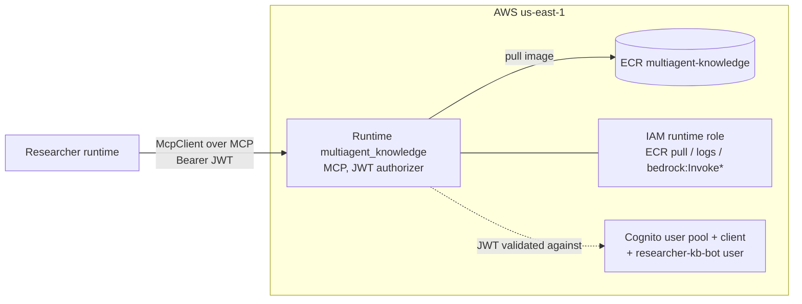

# Knowledge agent — architecture

Technical reference for the `agents/knowledge` deployable: the project's first agent
that serves the **MCP protocol** instead of the HTTP `/invocations` contract, and the
first **internal** agent reached only over MCP (no A2A door). Companion to the
[researcher's architecture](../researcher/ARCHITECTURE.md) — the two are the iter-8
pair that demonstrate a cross-runtime MCP call.

Code: [agents/knowledge/src/](../../../agents/knowledge/src/) ·
Infra: [infra/knowledge.tf](../../../infra/knowledge.tf) ·
History: [CHANGELOG.md](../../../CHANGELOG.md) iter 8.

---

## 1. What it is

The knowledge agent is an **MCP server** (TypeScript, ESM, Node 20, ARM64) exposing
one deterministic tool, `kb_lookup(topic)`, that returns a canned fact from a tiny
in-code knowledge base. It runs **no LLM** — the lookup is a pure function. Its job is
to be *called by another runtime over MCP*, so the answer is deterministic on purpose:
if the researcher's reply contains an exact `kb_lookup` fact, the cross-runtime hop
provably fired.

Unlike every prior agent (supervisor/router/critic), whose AgentCore runtime serves the
HTTP `/ping`+`/invocations` contract, the knowledge runtime sets
`server_protocol = "MCP"` and serves the **Model Context Protocol** over streamable
HTTP at `POST /mcp`.

One Docker image, **one** AgentCore runtime — and **no A2A door** (the plan keeps
internal sub-agents off A2A):

| Runtime | Protocol | Port / path | Auth | Purpose |
|---|---|---|---|---|
| `multiagent_knowledge` | MCP | `:8080` `POST /mcp` + `GET /ping` | OAuth JWT (Cognito) | internal MCP tool server — called by the researcher over MCP |

---

## 2. Components

### Process layout (inside the container)

```
node agents/knowledge/dist/app.js
│
└── Express app  :8080
    ├── GET  /ping   → {"status":"ok"}                 (AgentCore health check)
    ├── POST /mcp    → MCP streamable-HTTP transport    (JSON-RPC: initialize, tools/list, tools/call)
    └── GET/DELETE /mcp → 405 (stateless server is POST-only)
```

It does **not** import `@multiagent/common` — that wrapper speaks the HTTP agent
contract; this runtime speaks MCP. It depends only on `@modelcontextprotocol/sdk`,
`express`, and `zod`.

### Source files and responsibilities

| File | Responsibility |
|---|---|
| [src/app.ts](../../../agents/knowledge/src/app.ts) | Entry point. Express on 8080: `GET /ping`, `POST /mcp` (delegates to `handleMcpRequest`), `405` for non-POST `/mcp`. |
| [src/mcp-server.ts](../../../agents/knowledge/src/mcp-server.ts) | Builds the `McpServer`, registers `kb_lookup` (zod input schema `{topic}`), and a **stateless** `StreamableHTTPServerTransport` (`sessionIdGenerator: undefined`). Fresh server+transport **per request**, closed on response end. |
| [src/kb.ts](../../../agents/knowledge/src/kb.ts) | The pure knowledge base: `KB` registry, `normalizeTopic`, `lookup(topic)` (total — an unknown topic is a normal not-found result, never a throw), `knownTopics`. The unit-tested seam. |

### Why a stateless transport, fresh per request

AgentCore Runtime is horizontally scaled and per-request — there are no sticky
sessions. A stateless MCP transport (`sessionIdGenerator: undefined`) makes each MCP
request self-contained, the MCP analogue of the "fresh `Agent` per invocation" rule the
LLM agents follow. A fresh `McpServer` + transport per request keeps concurrent callers
isolated; both are closed when the HTTP response finishes so nothing leaks across the
scaled runtime.

### The lookup contract: deterministic by design

`lookup(topic)` is pure and **total**: known topics return their exact fact; unknown or
empty topics return a deterministic not-found sentence naming the known topics. Topic
keys are pre-normalized (lowercase, trimmed) and unique. These invariants are gated by
Vitest with no MCP server and no Bedrock (see
[test/kb.test.ts](../../../agents/knowledge/test/kb.test.ts)) — the determinism is what
makes the researcher's grounded answer trustworthy proof of the hop.

---

## 3. Flow sequence — researcher → knowledge over MCP

```mermaid
sequenceDiagram
    autonumber
    participant R as Researcher runtime<br/>(McpClient)
    participant COG as Amazon Cognito<br/>(knowledge's own pool)
    participant DP as AgentCore data plane
    participant RT as Runtime multiagent_knowledge<br/>(MCP protocol, JWT authorizer)
    participant W as Express :8080  POST /mcp
    participant S as McpServer + transport<br/>(fresh per request)
    participant KB as kb.ts lookup (pure)

    R->>COG: initiate-auth USER_PASSWORD_AUTH (researcher-kb-bot)
    COG-->>R: JWT access token
    R->>DP: POST /runtimes/{arn}/invocations/mcp<br/>Authorization: Bearer JWT<br/>{jsonrpc, method:"tools/call", params:{name:"kb_lookup", arguments:{topic}}}
    DP->>DP: validate JWT against discovery_url; client_id ∈ allowed_clients
    alt token invalid/missing
        DP-->>R: 401 / 403
    end
    DP->>RT: route to session microVM
    RT->>W: POST /mcp (MCP JSON-RPC)
    W->>S: handleMcpRequest(req, res, body)
    S->>KB: kb_lookup({topic}) → lookup(topic)
    KB-->>S: exact fact (or deterministic not-found)
    S-->>R: SSE: {result:{content:[{type:"text", text:"...fact..."}]}}
```

Each call is a pure function behind a JSON-RPC round-trip — **no model calls**, so it is
fast and free.

---

## 4. Inbound auth — why JWT, not "no-auth"

AgentCore **Runtime** has no no-auth mode: its inbound floor is **SigV4** (established
in the iter-4 SigV4-door findings — there is no `NONE`). The Strands `McpClient`
transport makes **unsigned** HTTPS calls (it can't SigV4-sign — the sibling project
learned this on its Gateway). So a SigV4-floor MCP runtime would reject the researcher.

Resolution: the knowledge MCP runtime carries a **Cognito JWT authorizer** (the same
mechanism every A2A door in this repo uses), and the researcher authenticates with a
**bearer token** passed via `McpClient`'s `headers`. The knowledge agent has its **own**
Cognito pool + a machine-identity user (`researcher-kb-bot`), distinct from every A2A
pool — tokens are never interchangeable.

> Contrast the sibling project, which solved the same `McpClient`-can't-sign problem on
> an AgentCore **Gateway** with `authorizer_type = "NONE"`. A Gateway *can* be no-auth; a
> Runtime cannot. Keeping the callee a real **runtime** (the plan's intent — "a separate
> agent runtime over MCP") is what forces the JWT choice here.

---

## 5. Deployment topology



- **Own deployable.** Own ECR repo, runtime, IAM role, and Cognito pool — added with one
  `module "knowledge"` block (the reusable agent module, now with an optional
  `server_protocol` + `jwt_authorizer`). No shared-infra files changed: the deploy role
  is already scoped `multiagent-*`.
- **No A2A.** Internal sub-agent — not in the a2d-ai tester surface. The only caller is
  the researcher, over MCP.
- **`bedrock:InvokeModel` is granted but unused** — the lookup is pure. Kept uniform via
  the shared module baseline rather than special-casing the role.

---

## 6. Configuration (env vars)

| Var | Default | Set by | Effect |
|---|---|---|---|
| `PORT` | `8080` | Dockerfile | port of the MCP/HTTP listener |
| `LOG_LEVEL` | `info` | Terraform | reserved for future log filtering |
| `MODEL_ID` | (set, unused) | Terraform | present from the shared module baseline; the agent runs no model |

The knowledge agent has no behavior knobs — its tool is deterministic. To add facts,
extend the `KB` array in [src/kb.ts](../../../agents/knowledge/src/kb.ts) (the tests
assert registry invariants).

---

## 7. Operational notes

- **Health check**: `GET :8080/ping` → `{"status":"ok"}`.
- **Calling it directly** (debug): mint a token from the knowledge pool
  (`terraform output -raw knowledge_mcp_bot_password` + `initiate-auth` against
  `knowledge_mcp_cognito_client_id`), then `POST` an MCP `tools/list`/`tools/call` to
  `terraform output -raw knowledge_mcp_url` with `Authorization: Bearer <token>` and
  `Accept: application/json, text/event-stream`.
- **Observability**: container logs land in CloudWatch under `/aws/bedrock-agentcore/*`;
  boot logs the tool name + known topics.
- **Rollback**: `terraform destroy -target=module.knowledge` (+ the Cognito resources in
  `knowledge.tf`) removes the knowledge agent; the researcher then degrades to 0 remote
  tools (always-green).

---

## 8. Design decisions (summary)

Full reasoning lives in the [iter-8 prompt log](../../prompts/iter-8.md); the short
version:

| Decision | Why |
|---|---|
| Runtime serves MCP (`server_protocol="MCP"`), not a Gateway+Lambda | The plan wants "a separate **agent runtime** over MCP"; a runtime *is* the MCP endpoint, no Gateway hop |
| Deterministic, LLM-free `kb_lookup` | Makes the cross-runtime hop provable by exact output (not graded by an LLM); fast + free |
| JWT authorizer + own Cognito pool | AgentCore Runtime has no no-auth mode (SigV4 floor); `McpClient` can't SigV4-sign, so a bearer token is the path |
| Stateless transport, fresh server per request | Matches AgentCore's scaled per-request model; isolates concurrent callers (MCP analogue of "fresh Agent per invocation") |
| No `@multiagent/common` dependency | That wrapper is the HTTP contract; this runtime serves MCP — different contract, leaner deps |
| No A2A door | Internal sub-agent; the plan exposes A2A only on the top-most (public) agent |
| MCP server SDK pinned `^1.29.0` | The official `@modelcontextprotocol/sdk` (already a Strands transitive dep); the Strands SDK ships only the MCP *client* |
