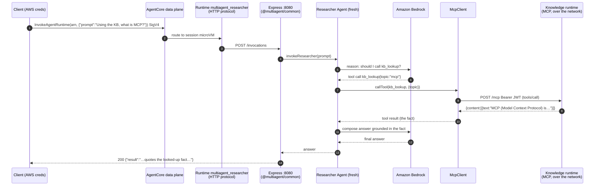
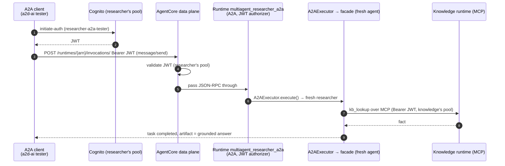
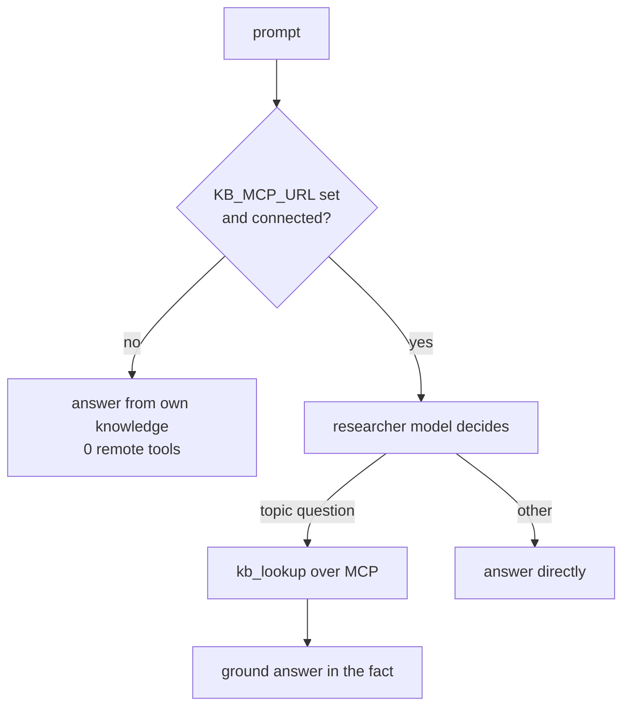
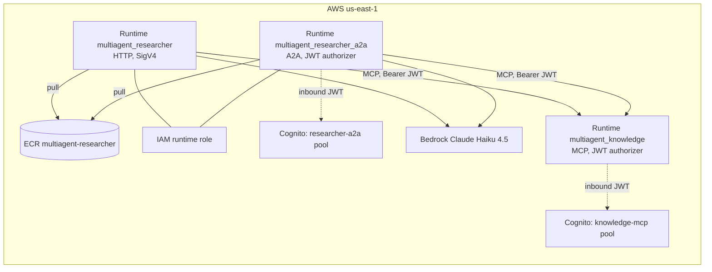

# Researcher agent — architecture

Technical reference for the `agents/researcher` deployable: the project's first agent
that calls **another runtime over MCP** (the in-process → distributed jump). Companion
to the [knowledge agent's architecture](../knowledge/ARCHITECTURE.md) — the two are the
iter-8 pair. Same deployment plumbing as the supervisor/router/critic; the new thing is
a remote MCP tool instead of in-process sub-agents.

Code: [agents/researcher/src/](../../../agents/researcher/src/) ·
Infra: [infra/researcher.tf](../../../infra/researcher.tf),
[infra/researcher-a2a.tf](../../../infra/researcher-a2a.tf) ·
History: [CHANGELOG.md](../../../CHANGELOG.md) iter 8.

---

## 1. What it is

The researcher is an LLM agent (Strands Agents SDK, TypeScript, ESM, Node 20, ARM64)
that answers questions about project topics by calling the **separately-deployed
knowledge agent over MCP** and grounding its answer in the looked-up fact. It is the
**public caller** of the iter-8 pair; the knowledge runtime it calls stays internal.

The contrast with the earlier agents is the whole point of the iteration:

| Agent | How it reaches its sub-agents | Boundary |
|---|---|---|
| supervisor | `agent.asTool()` | in-process |
| router | Strands `Graph` nodes | in-process |
| critic | generator/critic code loop | in-process |
| **researcher** | **`McpClient` → knowledge runtime** | **across the network (MCP)** |

One Docker image. Two AgentCore runtimes run that same image with different protocols:

| Runtime | Protocol | Port / path | Auth | Purpose |
|---|---|---|---|---|
| `multiagent_researcher` | HTTP | `:8080` `/invocations` + `/ping` | AWS SigV4 | programmatic AWS callers, CI smoke test |
| `multiagent_researcher_a2a` | A2A | `:9000` `/` (JSON-RPC) + agent card + `/ping` | OAuth JWT (Cognito) | the **public door** — browser A2A clients (a2d-ai tester) |

Both runtimes carry the `KB_MCP_*` env, so the MCP hop fires on either path.

---

## 2. Components

### Process layout (inside the container)

```
node agents/researcher/dist/app.js
│
├── Express app #1  :8080            ← always on (AgentCore HTTP contract)
│   ├── GET  /ping          → {"status":"ok"}
│   └── POST /invocations   → invokeResearcher(prompt) → {"result": "..."}
│       (from @multiagent/common — SDK-agnostic wrapper)
│
└── Express app #2  :9000            ← only when A2A_ENABLED=true
    ├── GET  /ping                          → {"status":"Healthy"}
    ├── GET  /.well-known/agent-card.json   → Agent Card
    └── POST /                              → A2A JSON-RPC
```

The MCP **client** connection to the knowledge runtime is made from inside the agent
(not a separate listener): a memoized `McpClient` whose remote tools are added to the
researcher `Agent`'s `tools` list.

### Source files and responsibilities

| File | Responsibility |
|---|---|
| [src/app.ts](../../../agents/researcher/src/app.ts) | Entry point. Starts the 8080 wrapper; fires a non-blocking `logMcpStatus()` boot probe; starts the A2A listener iff `A2A_ENABLED=true` (failure logged, never kills invoke). |
| [src/agent.ts](../../../agents/researcher/src/agent.ts) | Local Bedrock model factory; `resolveKbMcpUrl` (pure URL gate); the memoized `McpClient` builder (mints a bearer token, passes it via `headers`, `continueOnError` so an outage → 0 tools); a token-refresh timer; **fresh researcher per request** with the remote tool(s); opt-in `LOG_DELEGATION` logs each remote tool call. `invokeResearcher` is the `/invocations` callback. |
| [src/kb-auth.ts](../../../agents/researcher/src/kb-auth.ts) | The MCP-auth seam. `resolveKbAuthConfig` (env → `{clientId, username, password, region}` or undefined), `buildInitiateAuthRequest` (the Cognito InitiateAuth shape — pure), `mintKbToken` (the one impure call: `fetch` to Cognito, returns the JWT). No AWS SDK dependency. |
| [src/a2a.ts](../../../agents/researcher/src/a2a.ts) | The public A2A door: Agent Card (one `research` skill), a fresh-agent-per-call facade adapting the answer string to an `AgentResult`, and the 9000 listener with `/ping`. |
| [packages/common](../../../packages/common/src/server.ts) | Shared `/ping`+`/invocations` Express wrapper (SDK-agnostic). |

### The MCP connection — optional forever, token-authenticated

Mirrors the sibling's optional-Gateway pattern, made stricter:

1. **Gated on `KB_MCP_URL`.** Unset → 0 remote tools, the researcher answers from its own
   knowledge (always-green: `/invocations` must return a valid answer regardless).
2. **Bearer-token authenticated.** The knowledge MCP runtime is JWT-gated (AgentCore
   Runtime has no no-auth mode, and `McpClient` can't SigV4-sign). The researcher mints a
   Cognito access token (`USER_PASSWORD_AUTH`, the same flow the get-a2a-token workflow
   uses) and passes it via `McpClient`'s `headers: { Authorization: "Bearer …" }`.
3. **`continueOnError`.** A knowledge-runtime outage or auth failure degrades to 0 tools,
   not a 500.
4. **Token refresh.** Cognito access tokens last ~1 h; a timer rebuilds the `McpClient`
   (with a fresh token) every 50 min, `unref()`'d so it never keeps the process alive.

`resolveKbMcpUrl`, `resolveKbAuthConfig`, and `buildInitiateAuthRequest` are pure +
env-injectable, so the gate, the config resolution, and the Cognito request shape are
unit-tested with **no network** (see [test/](../../../agents/researcher/test/)); only
`mintKbToken`'s `fetch` is impure, and it's exercised live by the deploy smoke test.

### Why a fresh researcher per request

A Strands `Agent` carries an invocation lock + history; a shared instance would
serialize concurrent requests and bleed state. `createResearcher()` builds a new agent
per call. The `McpClient` itself is memoized — it is a connection, not conversational
state.

---

## 3. Flow sequences

### 3.1 HTTP path — SigV4 client → `/invocations` → MCP hop



The looked-up fact appearing in the answer is the proof the cross-runtime hop fired
(the model can't fabricate the exact `kb_lookup` string). Each invocation costs the
researcher's own model calls plus **one free** MCP round-trip per `kb_lookup`.

### 3.2 A2A path — bearer-token client → JSON-RPC → MCP hop



Two distinct Cognito pools are in play: the **researcher's** pool gates the inbound A2A
call; the **knowledge's** pool gates the outbound MCP call. They are independent.

### 3.3 The tool-call decision



---

## 4. Deployment topology



- **Own deployable.** Own ECR repo, two runtimes, IAM role, and A2A Cognito pool — added
  with one `module "researcher"` block + one `researcher-a2a.tf`. The `KB_MCP_*` env is
  wired from the knowledge module's outputs (`depends_on` via the module reference), so
  the MCP URL points at a real runtime at apply time.
- **One image, two runtimes** (`multiagent-researcher:{git sha}`): HTTP omits
  `A2A_ENABLED`; A2A sets it.
- **`runtime_arns` map** gains `researcher` (HTTP target) and `knowledge` (MCP target,
  not invoke-able via `invoke-agent-runtime` — call it over MCP).

---

## 5. Configuration (env vars)

| Var | Default | Set by | Effect |
|---|---|---|---|
| `PORT` | `8080` | Dockerfile | HTTP contract listener port |
| `MODEL_ID` | `global.anthropic.claude-haiku-4-5-20251001-v1:0` | Terraform | Bedrock model / inference profile |
| `AWS_REGION` | `us-east-1` (fallback) | runtime env | Bedrock + Cognito region |
| `KB_MCP_URL` | unset | Terraform | knowledge MCP endpoint; **unset → 0 remote tools** |
| `KB_MCP_CLIENT_ID` | unset | Terraform | Cognito app client for the knowledge pool |
| `KB_MCP_USERNAME` | unset | Terraform | machine identity (`researcher-kb-bot`) |
| `KB_MCP_PASSWORD` | unset | Terraform | that identity's password |
| `A2A_ENABLED` | unset (off) | Terraform (A2A runtime only) | starts the 9000 A2A listener |
| `A2A_PORT` | `9000` | — | A2A listener port |
| `AGENTCORE_RUNTIME_URL` | — | injected by AgentCore | public URL on the Agent Card |
| `LOG_DELEGATION` | unset (off) | Terraform | logs `researcher → calling remote MCP tool <name>` — proof the hop fired |
| `LOG_LEVEL` | `info` | Terraform | reserved |

All four `KB_MCP_*` must be present for the authenticated MCP connection; a partial set
degrades to no auth header (the JWT-gated runtime rejects → 0 tools, surfaced in logs).

---

## 6. Operational notes

- **Health checks**: HTTP → `GET :8080/ping`; A2A → `GET :9000/ping`.
- **Bearer token for the A2A door**: `terraform output -raw researcher_a2a_tester_password`
  + `initiate-auth` against `researcher_a2a_cognito_client_id`, or run the
  **Get A2A token** workflow with `agent = researcher`.
- **Proving the hop**: with `LOG_DELEGATION=true`, a topic question logs
  `researcher → calling remote MCP tool kb_lookup`; the deploy smoke test requires the
  string "Model Context Protocol" (from the `mcp` fact) in the grounded answer.
- **Rollback**: `terraform destroy -target=module.researcher` (+ the A2A runtime & pool)
  removes the researcher without touching the other agents. Caller-only degrade: unset
  `KB_MCP_URL` (0 remote tools).

---

## 7. Design decisions (summary)

Full reasoning lives in the [iter-8 prompt log](../../prompts/iter-8.md); the short
version:

| Decision | Why |
|---|---|
| New top agent (not an MCP tool bolted onto the supervisor) | Strict additive — supervisor/router/critic stay byte-unchanged; consistent with iters 5/7 each adding a fresh folder |
| Calls a real runtime over MCP (not a Gateway+Lambda) | Demonstrates the in-process → distributed jump against a deployable **agent runtime**, the plan's intent |
| Bearer token via `McpClient` `headers`, minted from Cognito | AgentCore Runtime's SigV4 floor + `McpClient` can't SigV4-sign → JWT is the workable path; minted over `fetch` to avoid an AWS SDK dep |
| `KB_MCP_URL`-gated + `continueOnError` | always-green: the researcher answers even if the knowledge runtime is down |
| Token refresh timer (`unref`'d) | tokens expire in ~1 h; a long-lived runtime must not serve a stale token |
| Pure auth/url seams exported | gate + Cognito request shape unit-tested with no network (mirrors the router's `labelFromText`) |
| Two Cognito pools (researcher A2A inbound, knowledge MCP outbound) | independent auth boundaries; one agent's tokens must not authorize another |
| SDK pinned `1.4.0` | matches the other agents; reuses the proven A2A facade |
