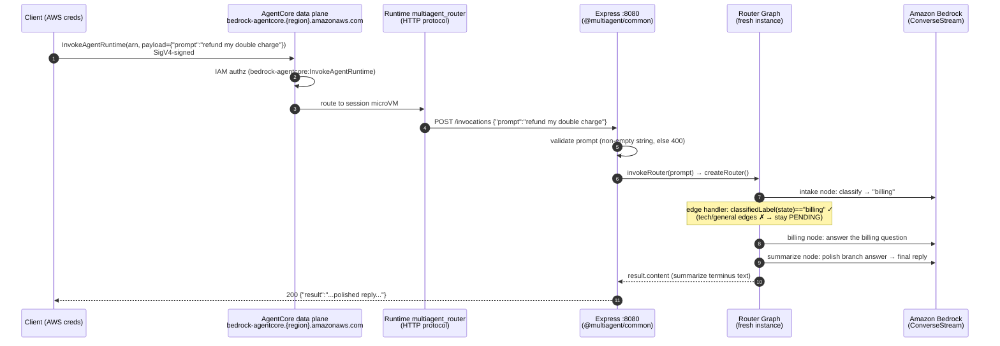
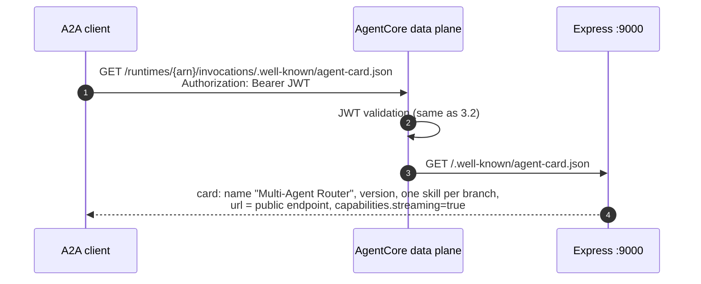
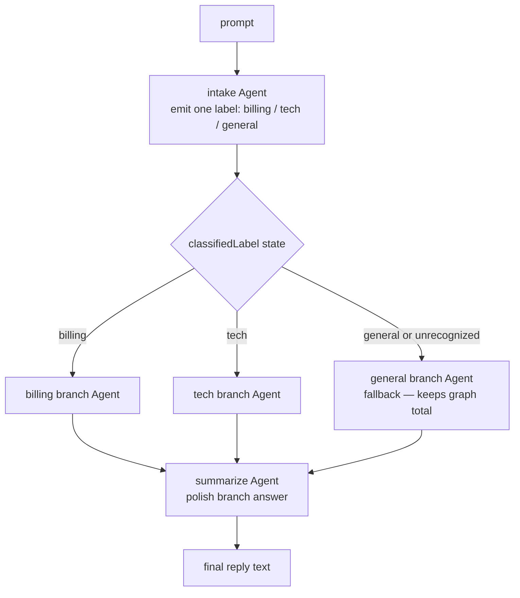
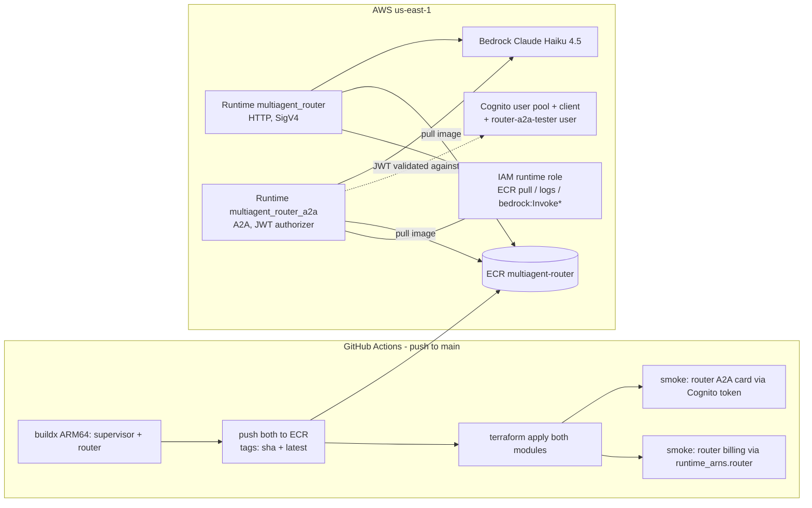

# Router agent — architecture

Technical reference for the `agents/router` deployable: components, deployment
topology, and how a client request flows through the conditional **Graph** end to
end. Companion to the [supervisor's architecture](../supervisor/ARCHITECTURE.md) —
same deployment plumbing, different orchestration primitive.

Code: [agents/router/src/](../../../agents/router/src/) ·
Infra: [infra/router.tf](../../../infra/router.tf),
[infra/router-a2a.tf](../../../infra/router-a2a.tf) ·
History: [CHANGELOG.md](../../../CHANGELOG.md) iter 5.

---

## 1. What it is

The router is a **conditional-graph router** built on the Strands Agents SDK
(TypeScript, ESM, Node 20, ARM64). Unlike the supervisor (agent-as-tool, where a
*model* picks a tool), routing here is an **explicit directed `Graph`**: an `intake`
node classifies the request into one label, **conditional edges** traverse exactly
one branch (`billing`, `tech`, or `general`), and a `summarize` node turns the
branch's answer into the final reply.

```
intake ──(label == "billing")──▶ billing ──┐
       ──(label == "tech")─────▶ tech ──────┤──▶ summarize
       ──(else / "general")────▶ general ───┘
```

Every node is a focused Strands `Agent` sharing the router's Bedrock model (Claude
Haiku 4.5 by default, via `MODEL_ID`); all run **in-process**.

One Docker image. Two AgentCore runtimes run that same image with different
protocols — the image decides what to serve from env vars:

| Runtime | Protocol | Port / path | Auth | Purpose |
|---|---|---|---|---|
| `multiagent_router` | HTTP | `:8080` `/invocations` + `/ping` | AWS SigV4 | programmatic AWS callers, CI smoke test |
| `multiagent_router_a2a` | A2A | `:9000` `/` (JSON-RPC) + agent card + `/ping` | OAuth JWT (Cognito) | the **public door** — browser A2A clients (a2d-ai tester) |

---

## 2. Components

### Process layout (inside the container)

```
node agents/router/dist/app.js
│
├── Express app #1  :8080            ← always on (AgentCore HTTP contract)
│   ├── GET  /ping          → {"status":"ok"}
│   └── POST /invocations   → invokeRouter(prompt) → {"result": "..."}
│       (from @multiagent/common — SDK-agnostic wrapper)
│
└── Express app #2  :9000            ← only when A2A_ENABLED=true
    ├── GET  /ping                          → {"status":"Healthy"}   (A2A contract)
    ├── GET  /.well-known/agent-card.json   → Agent Card
    └── POST /                              → A2A JSON-RPC (message/send, message/stream)
        (SDK middleware: A2AExpressServer → DefaultRequestHandler → A2AExecutor)
```

### Source files and responsibilities

| File | Responsibility |
|---|---|
| [src/app.ts](../../../agents/router/src/app.ts) | Entry point. Starts the 8080 wrapper; starts the A2A listener iff `A2A_ENABLED=true` (an A2A failure is logged but never kills the invoke path). |
| [src/branches.ts](../../../agents/router/src/branches.ts) | Branch registry (`ALL_BRANCHES`): each branch's `id` is simultaneously the classification **label**, the graph **node id**, and the card skill id. `general` is the total-graph fallback (`FALLBACK_BRANCH_ID`). Adding a branch = one entry. |
| [src/graph.ts](../../../agents/router/src/graph.ts) | `createRouterGraph(model)` — builds the intake/branch/summarize nodes and the conditional edges. `classifiedLabel(state)` reads intake's output off `MultiAgentState` and normalizes it to a known label (or the fallback); the per-branch `EdgeHandler`s gate on it. `maxSteps: 10` guards against runaway cycles. |
| [src/agent.ts](../../../agents/router/src/agent.ts) | Local Bedrock model factory (memoized); `createRouter()` builds a **fresh** graph per request and wires the opt-in `LOG_DELEGATION` hook; `invokeRouter(prompt)` returns the graph's terminus (summarize) text. |
| [src/a2a.ts](../../../agents/router/src/a2a.ts) | The A2A door: Agent Card (skills **derived from** `ALL_BRANCHES`), a fresh-graph-per-call facade that adapts the `Graph` output to an `AgentResult`, and the 9000 listener with `/ping`. Card URL precedence: `AGENTCORE_RUNTIME_URL` (injected by AgentCore) → `A2A_PUBLIC_URL` → localhost. |
| [packages/common](../../../packages/common/src/server.ts) | Shared `/ping`+`/invocations` Express wrapper. SDK-agnostic — it only knows `invoke(prompt) => Promise<string>`. |

### The routing contract: id === label === node id

A branch's `id` in `branches.ts` is used three ways at once:

1. **Graph node id** — `AgentNode` derives its id from `agent.id`, so each branch
   `Agent` is created with `id: <branch.id>`.
2. **Classification label** — the `intake` agent is prompted to emit exactly one of
   these strings.
3. **Edge condition** — each `intake → branch` edge's `EdgeHandler` returns
   `classifiedLabel(state) === branch.id`.

Keeping all three the same value in one registry is the entire routing logic; it's
why adding a branch is a single entry and why the agent card stays in sync for free.

### Why a fresh graph per request

A Strands `Agent` (and therefore every graph node) carries an **invocation lock and
conversation history**. A single shared graph would serialize concurrent requests
and leak state between callers. Both entry paths construct a new graph per request:

- HTTP path: `invokeRouter()` calls `createRouter()` each time.
- A2A path: the SDK's `A2AExecutor` holds one agent for the server's lifetime, so
  `a2a.ts` hands it a *facade* whose `invoke`/`stream` build a fresh graph per call.

Only the `BedrockModel` client is memoized (stateless, safe to share).

### Why summarize fires off a single branch

The SDK's `Graph` uses **AND-semantics** on a node's incoming edges (a node runs
only when *all* satisfied-source edges complete). `summarize` has an incoming edge
from every branch — but only the one branch the intake routed to ever runs; the
others stay `PENDING`. A `PENDING` source doesn't gate a downstream node, so
`summarize` fires as soon as the single branch that ran completes.

---

## 3. Flow sequences

### 3.1 HTTP path — SigV4 client → `/invocations`



Failure modes: empty prompt → `400 {"error":"prompt is required"}`; any thrown
error → `500 {"error":...}` logged. Health is `GET /ping` on 8080. A routed request
costs **3 model calls** (classify → branch → summarize).

### 3.2 A2A path — bearer-token client → JSON-RPC

```mermaid
sequenceDiagram
    autonumber
    participant C as A2A client<br/>(a2d-ai tester / curl)
    participant COG as Amazon Cognito<br/>(router's own user pool)
    participant DP as AgentCore data plane
    participant RT as Runtime multiagent_router_a2a<br/>(A2A protocol, JWT authorizer)
    participant A as Express :9000<br/>(A2A middleware)
    participant X as A2AExecutor → facade<br/>(fresh graph per call)
    participant B as Amazon Bedrock

    rect rgb(245,245,245)
    note over C,COG: Phase 1 — mint token (1 h validity)
    C->>COG: initiate-auth USER_PASSWORD_AUTH<br/>(router client-id, router-a2a-tester, password)
    COG-->>C: JWT access token
    end

    rect rgb(245,245,245)
    note over C,B: Phase 2 — JSON-RPC call
    C->>DP: POST /runtimes/{url-encoded arn}/invocations/<br/>Authorization: Bearer JWT<br/>{"method":"message/send", params:{message}}
    DP->>COG: validate JWT against discovery_url
    DP->>DP: check client_id ∈ allowed_clients
    alt token invalid/missing
        DP-->>C: 401 / 403
    end
    DP->>RT: pass JSON-RPC payload through
    RT->>A: POST / (root mount, port 9000)
    A->>X: DefaultRequestHandler → A2AExecutor.execute()
    X->>X: A2A parts → prompt; facade builds FRESH graph
    X->>B: graph runs (classify → branch → summarize)
    X->>X: graph output text → AgentResult (assistant TextBlock)
    X-->>A: result published as the task artifact
    A-->>C: {"result":{kind:"task",status:{state:"completed"},<br/>artifacts:[{parts:[{text:"...reply"}]}]}}
    end
```

Because a `Graph` returns a `MultiAgentResult` (no useful `toString`) and is not an
`InvokableAgent`, the facade adapts the graph's terminus text into an `AgentResult`
(`stopReason:'endTurn'`, an assistant `TextBlock`) so the executor publishes the real
reply as the artifact — byte-equal to the `/invocations` answer.

### 3.3 Agent-card discovery



The card's `url` self-corrects on AgentCore: the platform injects
`AGENTCORE_RUNTIME_URL` into the container and `a2a.ts` prefers it.

### 3.4 The conditional-graph routing decision



`classifiedLabel(state)` reads the intake node's content from `MultiAgentState`,
lowercases it, prefers an exact label match, then a word-boundary substring match,
and falls back to `general` for anything unrecognized — so the graph is **total**
(every request lands on exactly one branch).

---

## 4. Deployment topology



Key points:

- **Own deployable.** The router has its **own** ECR repo, runtime(s), IAM role, and
  Cognito pool — entirely separate from the supervisor. Adding it was one
  `module "router"` block + one `router-a2a.tf` (the proven new-agent template).
- **One image, two runtimes.** Both reference `multiagent-router:{git sha}`. The HTTP
  runtime omits `A2A_ENABLED` (port 9000 never opens); the A2A runtime sets it.
- **Per-agent ARN map.** `terraform output runtime_arns` →
  `{ supervisor = …, router = … }`; smoke tests select their target by agent key.
- **Auth is per-runtime and exclusive**: the JWT authorizer on the A2A runtime
  *replaces* SigV4; the HTTP runtime stays SigV4-only.

---

## 5. Configuration (env vars)

| Var | Default | Set by | Effect |
|---|---|---|---|
| `PORT` | `8080` | Dockerfile | port of the HTTP contract listener |
| `MODEL_ID` | `global.anthropic.claude-haiku-4-5-20251001-v1:0` | Terraform | Bedrock model / inference profile |
| `AWS_REGION` | `us-east-1` (fallback) | runtime env | Bedrock client region |
| `A2A_ENABLED` | unset (off) | Terraform (A2A runtime only) | starts the 9000 A2A listener |
| `A2A_PORT` | `9000` | — | A2A listener port (AgentCore contract expects 9000) |
| `AGENTCORE_RUNTIME_URL` | — | **injected by AgentCore** | public URL advertised on the Agent Card |
| `A2A_PUBLIC_URL` | unset | optional override | card URL when `AGENTCORE_RUNTIME_URL` absent |
| `LOG_DELEGATION` | unset (off) | Terraform (A2A runtime) / local | logs `router → node <id> (classified: <label>)` per node — proof the conditional edges fired |
| `LOG_LEVEL` | `info` | Terraform | reserved for future log filtering |

---

## 6. Operational notes

- **Health checks**: HTTP runtime → `GET :8080/ping`; A2A runtime → `GET :9000/ping`.
- **Getting a bearer token**: `terraform output -raw router_a2a_tester_password` +
  `aws cognito-idp initiate-auth` against `router_a2a_cognito_client_id`. (Unlike the
  supervisor, the router has no dedicated token-minting workflow yet — a deferred
  follow-up.)
- **Observability**: container logs land in CloudWatch under
  `/aws/bedrock-agentcore/*`. With `LOG_DELEGATION=true` each node start is one log
  line. *Caveat*: the `BeforeNodeCallEvent` for the `intake` node fires before intake
  has emitted output, so that one line shows the fallback label; the **branch** node
  that fires next always carries the correct classification.
- **Rollback**: `terraform destroy -target=module.router` (+ the A2A runtime and
  Cognito pool) removes the router without touching the supervisor; the container-level
  A2A listener is just `router_a2a_enabled` off.

---

## 7. Design decisions (summary)

Full reasoning lives in the [iter-5 prompt log](../../prompts/iter-5.md); the short
version:

| Decision | Why |
|---|---|
| Explicit `Graph` + conditional edges | iter-5 goal: explicit routing topology, not a model picking a tool |
| id === label === node id (one registry) | the whole routing contract in one place; adding a branch is one entry |
| `general` fallback branch | makes the graph total — every request routes, no stuck state |
| Fresh graph per request | nodes are stateful Agents; isolation over reuse (same as supervisor) |
| SDK pinned to `1.4.0` | reuses the supervisor's proven A2A facade; 1.5.0 needs `agentFactory` + a snapshot Agent |
| Facade adapts `Graph` → `AgentResult` | `A2AExecutor` consumes an Agent result; keeps A2A answer == `/invocations` answer |
| Second runtime for A2A | JWT authorizer replaces SigV4; flipping in place breaks SigV4 callers |
| Router's own Cognito pool | one agent's tokens must not authorize the other |
