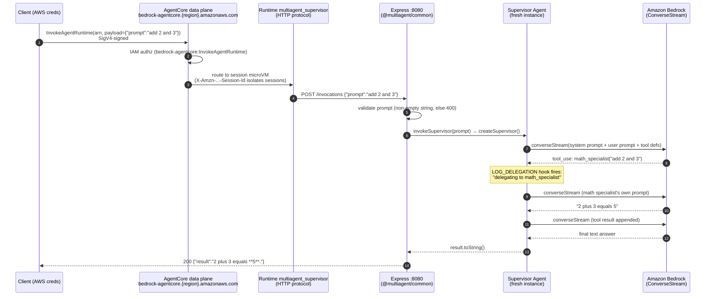
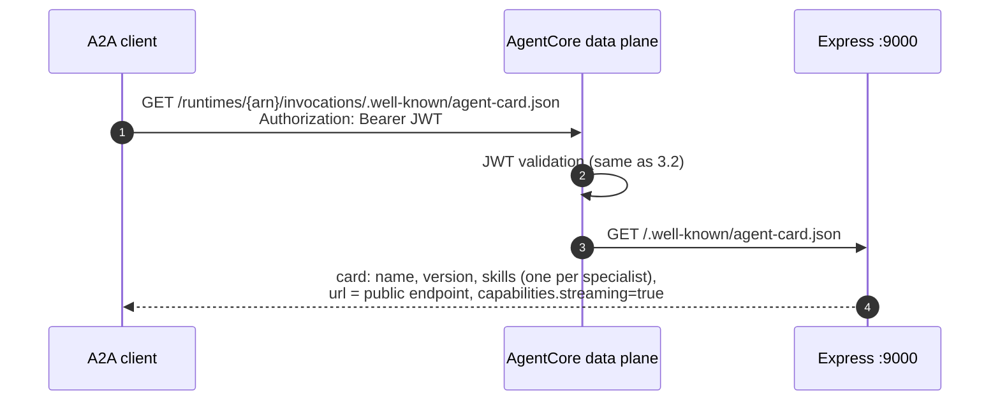
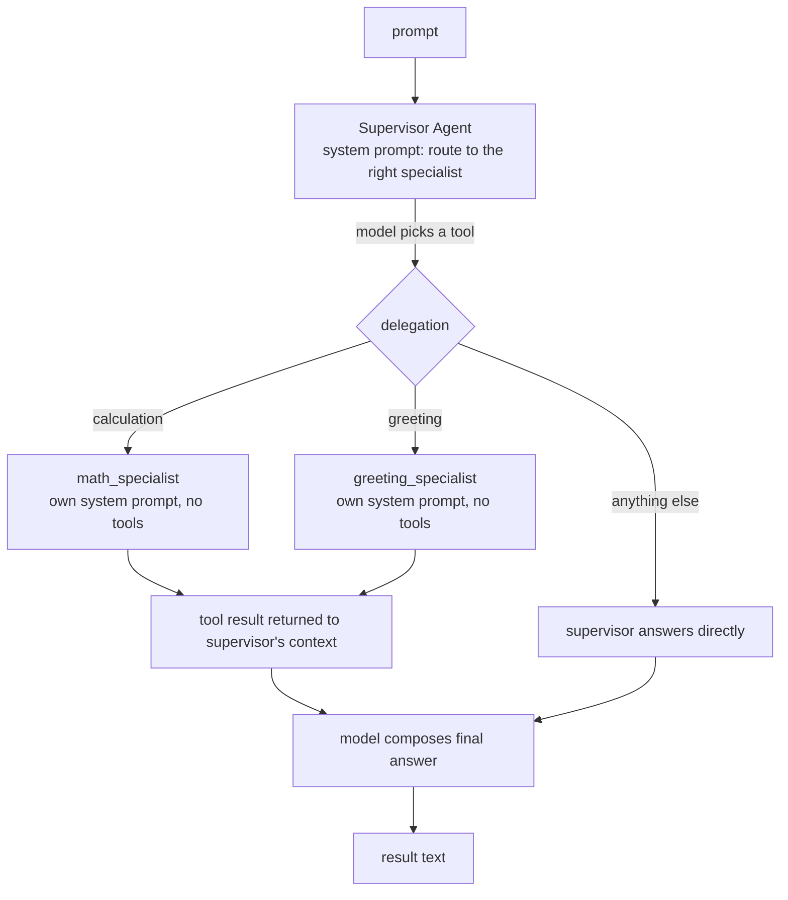
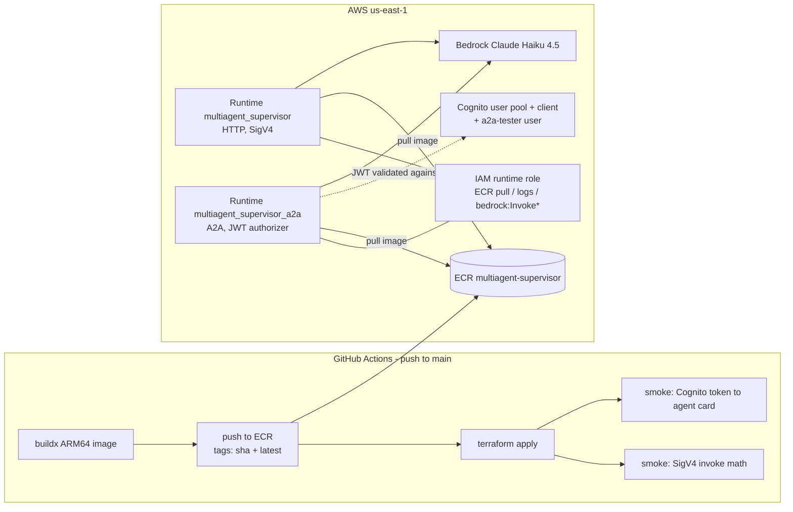

# Supervisor agent — architecture

Technical reference for the `agents/supervisor` deployable: components, deployment
topology, and — most importantly — how a client request flows through the system
end to end.

Code: [agents/supervisor/src/](../../../agents/supervisor/src/) ·
Infra: [infra/supervisor.tf](../../../infra/supervisor.tf),
[infra/supervisor-a2a.tf](../../../infra/supervisor-a2a.tf) ·
History: [CHANGELOG.md](../../../CHANGELOG.md) iters 1–4.

---

## 1. What it is

The supervisor is an **agent-as-tool router** built on the Strands Agents SDK
(TypeScript, ESM, Node 20, ARM64). A top-level `Agent` holds two specialist
`Agent`s — `math_specialist` and `greeting_specialist` — wrapped as *tools* via
`agent.asTool()`. The supervisor's Bedrock model (Claude Haiku 4.5 by default,
via `MODEL_ID`) sees the specialists as ordinary tools and "delegates" by calling
them; the specialists run **in-process**, sharing the supervisor's model client.

One Docker image. Two AgentCore runtimes run that same image with different
protocols — the image decides what to serve from env vars:

| Runtime | Protocol | Port / path | Auth | Purpose |
|---|---|---|---|---|
| `multiagent_supervisor` | HTTP | `:8080` `/invocations` + `/ping` | AWS SigV4 | programmatic AWS callers, CI smoke test |
| `multiagent_supervisor_a2a` | A2A | `:9000` `/` (JSON-RPC) + agent card + `/ping` | OAuth JWT (Cognito) | the **public door** — browser A2A clients (a2d-ai tester) |

---

## 2. Components

### Process layout (inside the container)

```
node agents/supervisor/dist/app.js
│
├── Express app #1  :8080            ← always on (AgentCore HTTP contract)
│   ├── GET  /ping          → {"status":"ok"}
│   └── POST /invocations   → invokeSupervisor(prompt) → {"result": "..."}
│       (from @multiagent/common — SDK-agnostic wrapper)
│
└── Express app #2  :9000            ← only when A2A_ENABLED=true
    ├── GET  /ping                          → {"status":"Healthy"}   (A2A contract)
    ├── GET  /.well-known/agent-card.json   → Agent Card
    └── POST /                              → A2A JSON-RPC (message/send, message/stream)
        (SDK middleware: A2AExpressServer → DefaultRequestHandler → A2AExecutor)
```

### Source files and responsibilities

| File | Responsibility |
|---|---|
| [src/app.ts](../../../agents/supervisor/src/app.ts) | Entry point. Starts the 8080 wrapper; starts the A2A listener iff `A2A_ENABLED=true` (an A2A failure is logged but never kills the invoke path). |
| [src/agent.ts](../../../agents/supervisor/src/agent.ts) | `createSupervisor()` — builds a **fresh** supervisor `Agent` per request (model memoized, agents not); `invokeSupervisor(prompt)` — the callback handed to the wrapper; opt-in `LOG_DELEGATION` hook logs each tool delegation. |
| [src/specialists.ts](../../../agents/supervisor/src/specialists.ts) | The specialist registry (`ALL_SPECIALISTS`): name, description, and a `build(model)` factory per specialist. Adding a specialist = one new entry. |
| [src/a2a.ts](../../../agents/supervisor/src/a2a.ts) | The A2A door: Agent Card (skills **derived from** `ALL_SPECIALISTS`), a fresh-supervisor-per-request facade, and the 9000 listener with `/ping`. Card URL precedence: `AGENTCORE_RUNTIME_URL` (injected by AgentCore) → `A2A_PUBLIC_URL` → localhost. |
| [packages/common](../../../packages/common/src/server.ts) | Shared `/ping`+`/invocations` Express wrapper. Deliberately SDK-agnostic — it only knows `invoke(prompt) => Promise<string>`. |

### Why a fresh supervisor per request

A Strands `Agent` instance carries an **invocation lock and conversation
history**. A single shared instance would serialize concurrent requests and leak
one caller's conversation into another's. Both entry paths therefore construct a
new supervisor per request:

- HTTP path: `invokeSupervisor()` calls `createSupervisor()` each time.
- A2A path: the SDK's `A2AExecutor` holds one agent for the server's lifetime, so
  `a2a.ts` hands it a *facade* whose `invoke`/`stream` build a fresh supervisor
  per call — same isolation, despite the long-lived executor.

Only the `BedrockModel` client is memoized (stateless, safe to share).

---

## 3. Flow sequences

### 3.1 HTTP path — SigV4 client → `/invocations`



Failure modes: empty prompt → `400 {"error":"prompt is required"}`; any thrown
error → `500 {"error":...}` with the error logged. The runtime's health is
`GET /ping` on 8080.

### 3.2 A2A path — bearer-token client → JSON-RPC

Two phases: mint a token, then call. The AgentCore data plane — not the
container — enforces the JWT.

```mermaid
sequenceDiagram
    autonumber
    participant C as A2A client<br/>(a2d-ai tester / curl)
    participant COG as Amazon Cognito<br/>(user pool)
    participant DP as AgentCore data plane
    participant RT as Runtime multiagent_supervisor_a2a<br/>(A2A protocol, JWT authorizer)
    participant A as Express :9000<br/>(A2A middleware)
    participant X as A2AExecutor → facade<br/>(fresh supervisor per call)
    participant B as Amazon Bedrock

    rect rgb(245,245,245)
    note over C,COG: Phase 1 — mint token (1 h validity)
    C->>COG: initiate-auth USER_PASSWORD_AUTH<br/>(client-id, a2a-tester, password)
    COG-->>C: JWT access token (client_id claim)
    end

    rect rgb(245,245,245)
    note over C,B: Phase 2 — JSON-RPC call
    C->>DP: POST /runtimes/{url-encoded arn}/invocations/<br/>Authorization: Bearer JWT<br/>X-Amzn-...-Session-Id: uuid<br/>{"method":"message/send", params:{message}}
    DP->>COG: validate JWT against discovery_url<br/>(issuer, signature, expiry)
    DP->>DP: check client_id ∈ allowed_clients
    alt token invalid/missing
        DP-->>C: 401 (WWW-Authenticate) / 403
    end
    DP->>RT: pass JSON-RPC payload through unmodified
    RT->>A: POST / (root mount, port 9000)
    A->>X: DefaultRequestHandler → A2AExecutor.execute()
    X->>X: A2A message parts → content blocks;<br/>facade builds FRESH supervisor
    X->>B: supervisor.stream(content)
    B-->>X: tool_use → specialist → ... (same loop as 3.1)
    X-->>A: text deltas published as artifact chunks,<br/>then status: completed
    A-->>C: {"jsonrpc":"2.0","result":{kind:"task",<br/>status:{state:"completed"},<br/>artifacts:[{parts:[{text:"...42."}]}]}}
    end
```

`message/stream` follows the same path but returns the artifact deltas as
Server-Sent Events (the card advertises `streaming: true`).

### 3.3 Agent-card discovery



The card's `url` self-corrects on AgentCore: the platform injects
`AGENTCORE_RUNTIME_URL` into the container and `a2a.ts` prefers it, so the card
advertises the real public endpoint without any post-deploy re-apply.

### 3.4 The agent-as-tool loop (inside any request)



Every box that calls a model uses the **same** memoized `BedrockModel`
(`MODEL_ID`, `temperature 0.2`). A delegated request therefore costs 3 model
calls (route → specialist → compose); a direct answer costs 1.

---

## 4. Deployment topology



Key points:

- **One image, two runtimes.** Both reference `multiagent-supervisor:{git sha}`.
  The HTTP runtime omits `A2A_ENABLED` (port 9000 never opens); the A2A runtime
  sets `A2A_ENABLED=true`.
- **Shared execution role** (`module.supervisor`'s): ECR pull, CloudWatch logs,
  `bedrock:InvokeModel(+WithResponseStream)` on Anthropic foundation models and
  the account's inference profiles.
- **Auth is per-runtime and exclusive**: the JWT authorizer on the A2A runtime
  *replaces* SigV4 there; the HTTP runtime stays SigV4-only. This is why a second
  runtime exists instead of flipping the first (additive-only principle).
- **Session isolation** is platform-level: AgentCore routes each
  `X-Amzn-Bedrock-AgentCore-Runtime-Session-Id` to its own microVM.

---

## 5. Configuration (env vars)

| Var | Default | Set by | Effect |
|---|---|---|---|
| `PORT` | `8080` | Dockerfile | port of the HTTP contract listener |
| `MODEL_ID` | `global.anthropic.claude-haiku-4-5-20251001-v1:0` | Terraform | Bedrock model / inference profile |
| `AWS_REGION` | `us-east-1` (fallback) | runtime env | Bedrock client region |
| `A2A_ENABLED` | unset (off) | Terraform (A2A runtime only) | starts the 9000 A2A listener |
| `A2A_PORT` | `9000` | — | A2A listener port (AgentCore contract expects 9000) |
| `AGENTCORE_RUNTIME_URL` | — | **injected by AgentCore** | public URL advertised on the Agent Card |
| `A2A_PUBLIC_URL` | unset | optional override | card URL when `AGENTCORE_RUNTIME_URL` absent (e.g. local tunnel) |
| `LOG_DELEGATION` | unset (off) | Terraform (A2A runtime) / local | logs `supervisor → delegating to <tool>` per delegation |
| `LOG_LEVEL` | `info` | Terraform | reserved for future log filtering |

---

## 6. Operational notes

- **Health checks**: HTTP runtime → `GET :8080/ping`; A2A runtime →
  `GET :9000/ping` (the A2A contract's required health endpoint).
- **Getting a bearer token**: `terraform output -raw a2a_tester_password` +
  `aws cognito-idp initiate-auth` (see [iter-4 prompt log](../../prompts/iter-4.md)
  for copy-paste commands), or the manual **Get A2A token** GitHub workflow
  (publishes the token encrypted with the `A2A_TOKEN_PASSPHRASE` secret — the
  repo is public, raw tokens never appear in logs).
- **Observability**: container logs land in CloudWatch under
  `/aws/bedrock-agentcore/*`. With `LOG_DELEGATION=true` each routing decision is
  one log line — the cheapest proof that agent-as-tool delegation is happening.
- **Rollback**: the A2A door tears down with
  `terraform destroy -target=aws_bedrockagentcore_agent_runtime.supervisor_a2a -target=aws_cognito_user_pool.a2a`
  without touching the HTTP runtime; the container-level listener is just
  `A2A_ENABLED` off.

---

## 7. Design decisions (summary)

Full reasoning lives in the iteration prompt logs ([iter-3](../../prompts/iter-3.md),
[iter-4](../../prompts/iter-4.md)); the short version:

| Decision | Why |
|---|---|
| Specialists in-process, agent-as-tool | smallest multi-agent step; no Gateway/Lambda needed |
| `packages/common` is SDK-agnostic | avoids the Strands SDK's 18-peer-dep set in every consumer |
| A2A wiring per-agent, not in `common` | the reusable wrapper *is* the SDK (`A2AExpressServer`); only the card is per-agent |
| Fresh supervisor per request | `Agent` carries lock + history; isolation over reuse |
| Second runtime for A2A | JWT authorizer replaces SigV4; flipping in place breaks existing callers |
| Cognito `USER_PASSWORD_AUTH` | AWS-documented pattern; no hosted-UI domain; token = one CLI call |
